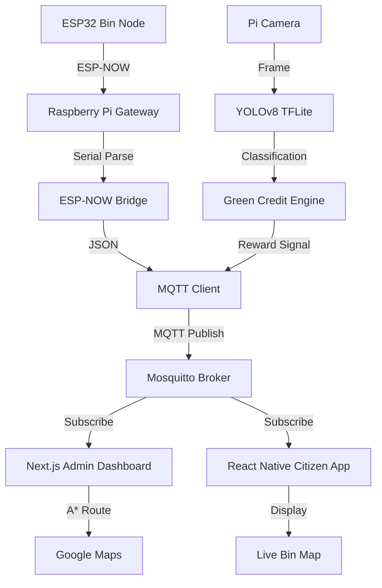

# SWACHH-AI System Architecture

## Communication Flow

## MQTT Topics

| Topic                    | Publisher   | Subscriber       | Payload                                    |
|--------------------------|-------------|------------------|--------------------------------------------|
| `swachh/bin_status`      | Gateway     | Admin Dashboard  | `{bin_id, fill_pct, lat, lng, timestamp}`  |
| `swachh/user_reward`     | Edge AI     | Citizen App      | `{user_id, credits, waste_type, timestamp}`|
| `swachh/route_update`    | Admin       | Driver App       | `{route_id, waypoints[], eta}`             |

## Data Flow: Waste Disposal Event

1. User approaches bin → HC-SR04 detects object < 20 cm
2. Pi Camera captures frame → YOLOv8 classifies waste
3. Green Credit engine computes reward
4. MQTT publishes `user_reward` to broker
5. Citizen app receives notification, updates Eco-Rank
6. Bin fill level updated via ESP-NOW → MQTT → Dashboard

## Power Management (ESP32 Nodes)

- **Active**: Read sensor → Transmit ESP-NOW → 50ms
- **Deep Sleep**: 30-second intervals between readings
- **Battery Life**: ~6 months on 3× AA batteries (estimated)
